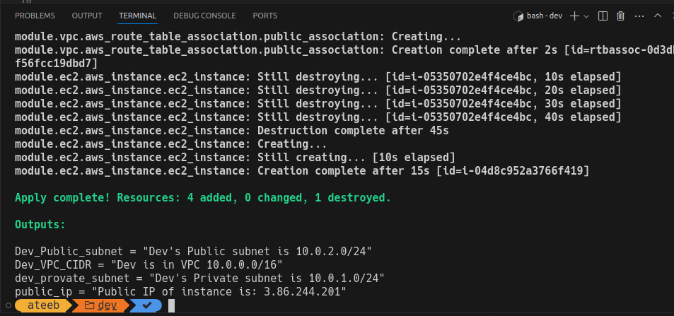
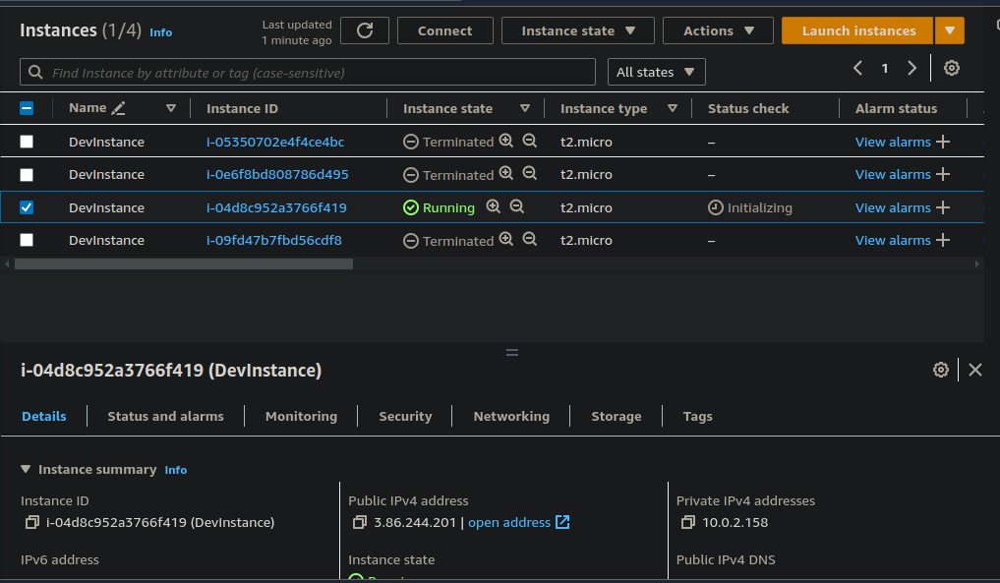
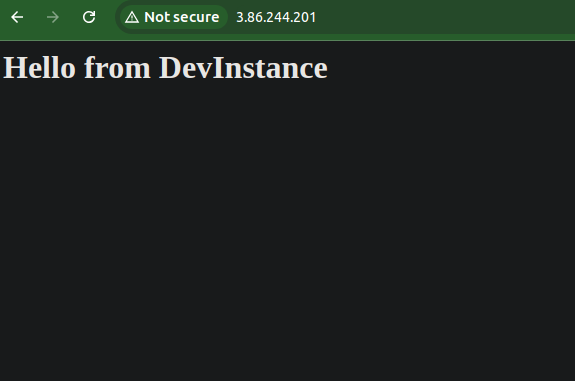
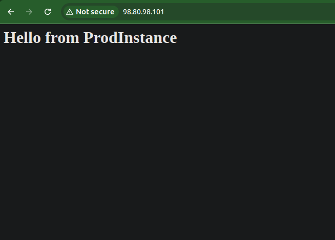
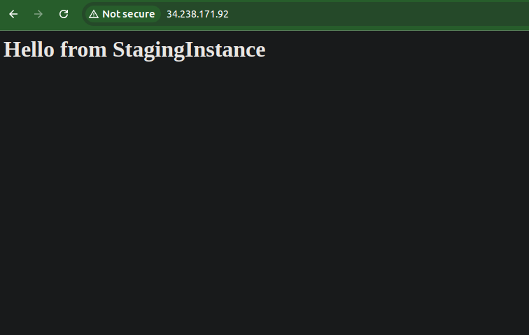
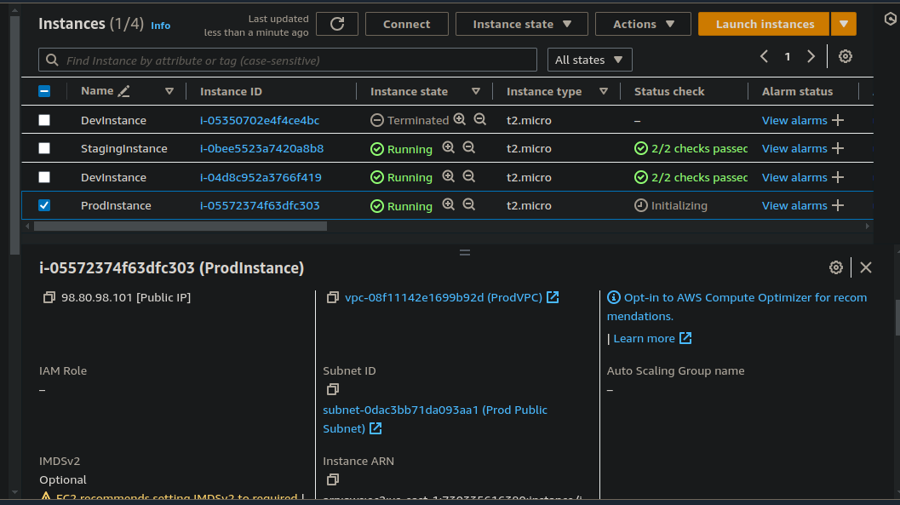

This is a Terraform Project and it has:
- Three root modules named dev, staging and prod
- Two Child modules named vpc and ec2

Doing terraform init and terraform apply in Dev's directory will create
an infrastructure for Dev environment while reading the Dev specific 
configuration from variables.tf file (inside dev dir) and then passing that
to child modules. 

Please use your OWN AWS account's access_Key and secret_key in variable.tf 
of each environment's .tf file. 

Specifically, when you do terraform apply in any of the directory, following will 
be created:
- A VPC with the name specified in variables.tf
- Two Subnet , one public and one private
- An internet gateway
- A route table for public subnet
- An EC2 instance will be created and placed in public subnet
- A public IP will be associated if the instance is in Public subnet (terraform conditions)
- A Key_Pair will be created in AWS if it didn't exist already (terraform conditions)
- A security group will be created and Port 22 and 80 will be allowed
- User data script will be passed to install nginx and a simple HTML sentence
- Terraform will output the VPC, subnet details and public IP of instance

Screenshots:

